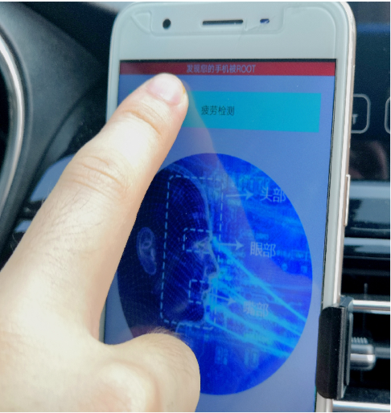
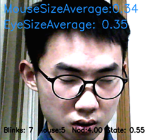

# FatigueDrivingAssistant
项目说明：
一款防止疲劳驾驶的神奇APP，通过部分由自己设计的算法，对驾驶员进行表情的分析和检测，判断是否疲劳驾驶。项目分AndroidAPP和疲劳驾驶判断接口两个部分。数据集为自采样的九千张不同光照、不同角度的疲劳\非疲劳状态照片， 训练模型基于调整的VGG神经网络，基于Tensorflow框架。使用时，APP摆设在驾驶员前方，手机实时摄取视频图像通过Socket传到服务器的接口，接口对视频进行分析，若疲劳驾驶，则传回参数，通过APP显示，并提示用户已疲劳驾驶。使用场景如图：

 

 文件说明：
eyecollect2.py是收集图像的文件
inputwithmodel.py是训练神经网络的文件
训练模型在reload2文件夹中 训练图像集在photo文件夹中
tireddrivinglocal3.py是实现疲劳检测的文件
tyr.py是连接神经网络和Android的后端

运行状况：
 
 
